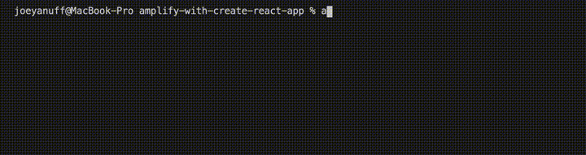
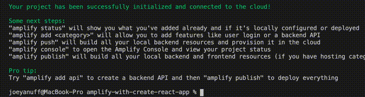
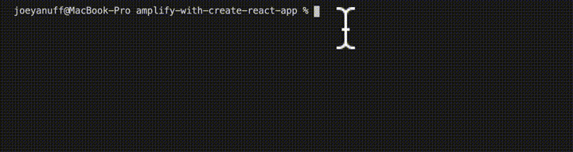
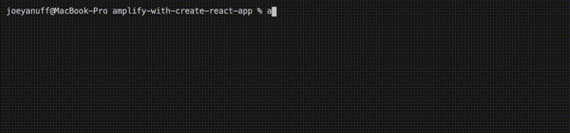
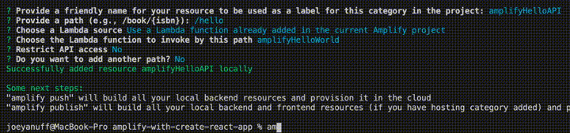
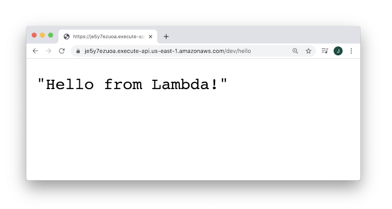
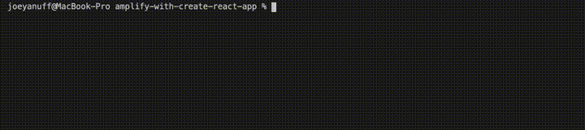
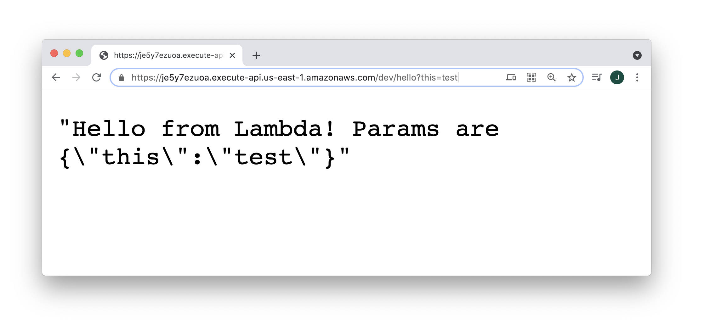

#### AWS Lambdas: Amplify CLI With Create React App  ####

#### Project Init ####

<pre><code>npx create-react-app amplify-with-create-react-app && cd $_</code></pre>

<pre><code>npm i -g @aws-amplify/cli</code></pre>

  
<strong>1. Log Hello World</strong>
  

  

  <table>
    <thead>
      <tr><th>
        📖 Amplify Docs: <a href="https://docs.amplify.aws/cli/start/workflows">Initialize new project</a>
      </th></tr>
    </thead>
  </table>

  

  <pre><code>amplify init</code></pre>

  

  

  

  <pre><code>amplify add function</code></pre>

  

  

  

  <table>
    <thead>
      <tr><th>
        ⚠️ Template format error: Resource name is non alphanumeric.
      </th></tr>
    </thead>
    <tbody>
      <tr><td>
        All names must be lowercase or camelCase. 
      </td></tr>
    </tbody>
  </table>

  

  <pre><code>amplify mock function amplifyHelloWorld</code></pre>

  

  

  

  
<strong>2. Deploy Hello World</strong>
  

  

  <table>
    <thead>
      <tr><th>
        📖 Amplify Docs: <a href="https://docs.amplify.aws/cli/restapi#create-a-rest-api">Create a REST API</a>
      </th></tr>
    </thead>
  </table>

  

  <pre><code>amplify add api</code></pre>

  

  

  

  <pre><code>amplify push</code></pre>

  

  

  

  

  

  <table>
    <thead>
      <tr><th>
        ⚠️ { "message:" : "Missing Authentication Token"}
      </th></tr>
    </thead>
    <tbody>
      <tr><td>
        Don't forget to add your route segment to url!
      </td></tr>
    </tbody>
  </table>

  

<strong>3. Pass URL Params</strong>

<table>
  <thead>
    <tr><th>
      📖 Amplify Docs: <a href="https://docs.amplify.aws/lib/restapi/fetch/q/platform/js#accessing-query-parameters--body-in-lambda-proxy-function">Accessing query parameters & body in Lambda proxy function</a>
    </th></tr>
  </thead>
</table>

<pre>
<code>exports.handler = async (event) => {
    const params = event.queryStringParameters
    console.log(params)
    const response = {
        statusCode: 200,
        body: JSON.stringify(`Hello from Lambda! Params are ${JSON.stringify(params)}`),
    }
    return response 
}</code>
</pre>

<pre><code>amplify mock function amplifyHelloWorld --event src/event.json</code></pre>

<table>
  <thead>
    <tr><th>
      ⚠️ Params are undefined
    </th></tr>
  </thead>
  <tbody>
    <tr><td>
      <a href="https://github.com/aws-amplify/amplify-cli/issues/6384">Possibly a new bug.</a>
    </td></tr>
  </tbody>
</table>

<pre><code>amplify push</code></pre>

  

<strong>4. Install NPM Packages</strong>

<em>Details in progress.</em>

<strong>5. Set Env Values</strong>

<em>Details in progress.</em>

<strong>6. Test Token</strong>

<em>Details in progress.</em>

<strong>7. Deploy Authenticated</strong>

<em>Details in progress.</em>

