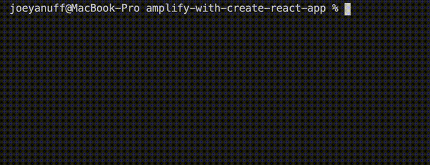

#### AWS Lambdas: Amplify CLI With Create React App  ####

#### Project Init ####

<pre><code>npx create-react-app amplify-with-create-react-app && cd $_</code></pre>

<pre><code>npm i -g @aws-amplify/cli</code></pre>

  
<strong>1. Log Hello World</strong>
  

  

  <table>
    <thead>
      <tr><th>
        📖 Amplify Docs: <a href="https://docs.amplify.aws/cli/start/workflows">Initialize new project</a>
      </th></tr>
    </thead>
  </table>

  

  <pre><code>amplify init</code></pre>

  

  

  

  <pre><code>amplify add function</code></pre>

  

  

  

  <table>
    <thead>
      <tr><th>
        ⚠️ Template format error: Resource name is non alphanumeric.
      </th></tr>
    </thead>
    <tbody>
      <tr><td>
        All names must be lowercase or camelCase. 
      </td></tr>
    </tbody>
  </table>

  

  <pre><code>amplify mock function amplifyHelloWorld</code></pre>

  

  

  

  
<strong>2. Deploy Hello World</strong>
  

  

  <table>
    <thead>
      <tr><th>
        📖 Amplify Docs: <a href="https://docs.amplify.aws/cli/restapi#create-a-rest-api">Create a REST API</a>
      </th></tr>
    </thead>
  </table>

  

  <pre><code>amplify add api</code></pre>

  

  

  

  <pre><code>amplify push</code></pre>

  

  

  

  

  

  <table>
    <thead>
      <tr><th>
        ⚠️ { "message:" : "Missing Authentication Token"}
      </th></tr>
    </thead>
    <tbody>
      <tr><td>
        Don't forget to add your route segment to url!
      </td></tr>
    </tbody>
  </table>

  

  
<strong>3. Pass URL Params</strong>
  

  

  

  <table>
    <thead>
      <tr><th>
        📖 Amplify Docs: <a href="https://docs.amplify.aws/lib/restapi/fetch/q/platform/js#accessing-query-parameters--body-in-lambda-proxy-function">Accessing query parameters & body in Lambda proxy function</a>
      </th></tr>
    </thead>
  </table>

  

  <pre><code>exports.handler = async (event) => {
      const response = {
          statusCode: 200,
          body: JSON.stringify(`Hello from Lambda! Params or event: ${JSON.stringify(event.queryStringParameters || event)}`),
      }
      return response 
  }</code></pre>

  

  <pre><code>amplify mock function amplifyHelloWorld --event src/event.json</code></pre>

  

  

  

  <table>
    <thead>
      <tr><th>
        ⚠️ Params are undefined
      </th></tr>
    </thead>
    <tbody>
      <tr><td>
        Use the event object from your local event.json to mock event.queryStringParameters. Alternately, set manually <a href="https://docs.amplify.aws/cli/restapi/testing#test-the-api-with-amplify-mock">like so</a>.
    </tbody>
  </table>

  

  <pre><code>amplify push</code></pre>

  

  

  

  

  

  

  

  
<strong>4. Install NPM Packages</strong>
  

  

  

  

  
<strong>5. Set Env Values</strong>
  

  

  <table>
    <thead>
      <tr><th>
        📖 Amplify Docs: <a href="https://docs.aws.amazon.com/lambda/latest/dg/configuration-envvars.html#configuration-envvars-config">Configuring environment variables</a>
      </th></tr>
    </thead>
  </table>

  

  

  

  <pre><code>exports.handler = async (event) => {
      const response = {
          statusCode: 200,
          body: JSON.stringify(`Hello from Lambda! process.env.ASTRA_DB_REGION: ${process.env.ASTRA_DB_REGION}. Params or event: ${JSON.stringify(event.queryStringParameters || event)}`),
      }
      return response 
  }</code></pre>

  

  <table>
    <thead>
      <tr><th>
        📖 Amplify Docs: <a href="https://docs.amplify.aws/cli/usage/mock#function-mock-environment-variables">Function mock environment variables</a>
      </th></tr>
    </thead>
    <tbody>
      <tr><td>
      You can also override any mock environment variables in a .env file within the function directory (ie. &lt;project root&gt;/amplify/backend/function/&lt;function name&gt;/.env).</td>
      </tr>
    </tbody>
  </table>

  

  <pre><code>ASTRA_DB_ID=18d8558b-e01c-4b5e-bb1b-f6ef05a81218
  ASTRA_DB_REGION=us-east-1
  ASTRA_DB_APPLICATION_TOKEN=AstraCS:NsivximNmFmseTaPjXaaxkWo:c13bcf62ab3a158b73ab1e1ad5ce69d8bde6d437e6f361abd5beea3974cfd9b6</code></pre>

  

  

  

  <pre><code>amplify push</code></pre>

  

  

  
<strong>6. Test Token</strong>
  

  

  <pre><code>const { createClient } = require("@astrajs/collections");

  exports.handler = async (event) => {

      // create an Astra client
      const astraClient = await createClient({
          astraDatabaseId: process.env.ASTRA_DB_ID,
          astraDatabaseRegion: process.env.ASTRA_DB_REGION,
          applicationToken: process.env.ASTRA_DB_APPLICATION_TOKEN,
      });

      const response = {
          statusCode: 200,
          body: JSON.stringify(`Hello from Lambda! process.env.ASTRA_DB_REGION: ${process.env.ASTRA_DB_REGION}. Params or event: ${JSON.stringify(event.queryStringParameters || event)}, astraClient: ${JSON.stringify(astraClient)}`),
      }
      return response 
  }</code></pre>

  

  <pre><code>amplify mock function amplifyHelloWorld --event src/event.json</code></pre>

  

  

  

  

  
<strong>7. Deploy Authenticated</strong>
  

  

  <pre><code>amplify push</code></pre>

  

  

  

