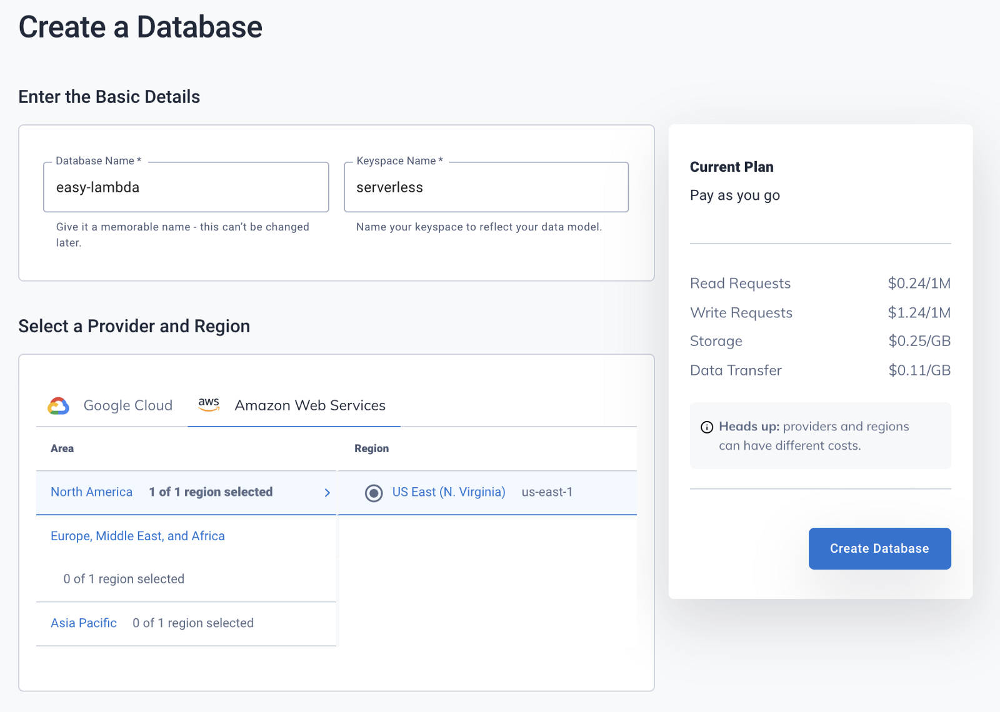
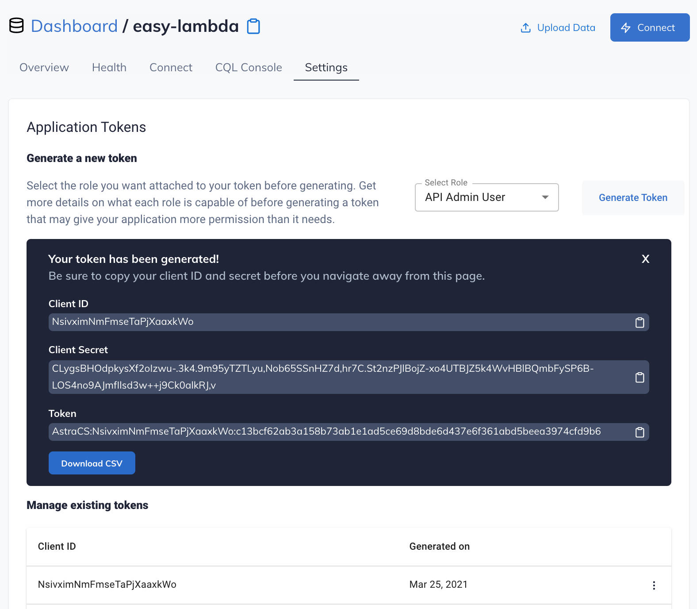
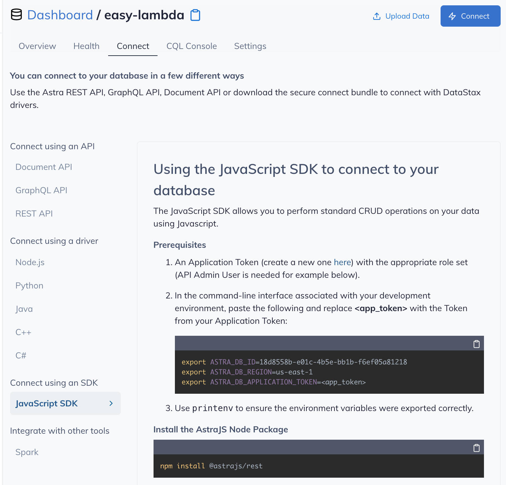

#### DataStax: Serverless Database Quickstart  ####

  
<strong>1. Make Account</strong>
  

  

  <table>
    <thead>
      <tr><th>
        📖 DataStax Registration: <a href="https://vercel.com/docs/serverless-functions/introduction#path-segments">Free Account</a>
      </th></tr>
    </thead>
  </table>

  

  
<strong>2. Create a Database</strong>
  

  

  <table>
    <thead>
      <tr><th>
        📖 DataStax Dashboard: <a href="https://nextjs.org/docs/deployment">Overview</a>
      </th></tr>
    </thead>
  </table>

  

  

  

  
<strong>3. Generate a New Token</strong>
  

  

  <table>
    <thead>
      <tr><th>
        📖 Database Settings: <a href="https://vercel.com/docs/serverless-functions/introduction#path-segments">Application Tokens</a>
      </th></tr>
    </thead>
  </table>

  

  

  

  

  
<strong>4. Note environment variables</strong>
  

  

  <table>
    <thead>
      <tr><th>
        📖 Database Connect: <a href="https://vercel.com/docs/serverless-functions/introduction#path-segments">Connect Using an SDK</a>
      </th></tr>
    </thead>
  </table>

  

  

  

  <pre><code>ASTRA_DB_ID=18d8558b-e01c-4b5e-bb1b-f6ef05a81218
  ASTRA_DB_REGION=us-east-1
  ASTRA_DB_KEYSPACE=serverless
  ASTRA_DB_APPLICATION_TOKEN=AstraCS:NsivximNmFmseTaPjXaaxkWo:c13bcf62ab3a158b73ab1e1ad5ce69d8bde6d437e6f361abd5beea3974cfd9b6</code></pre>

  

