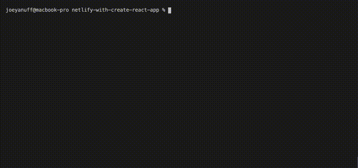
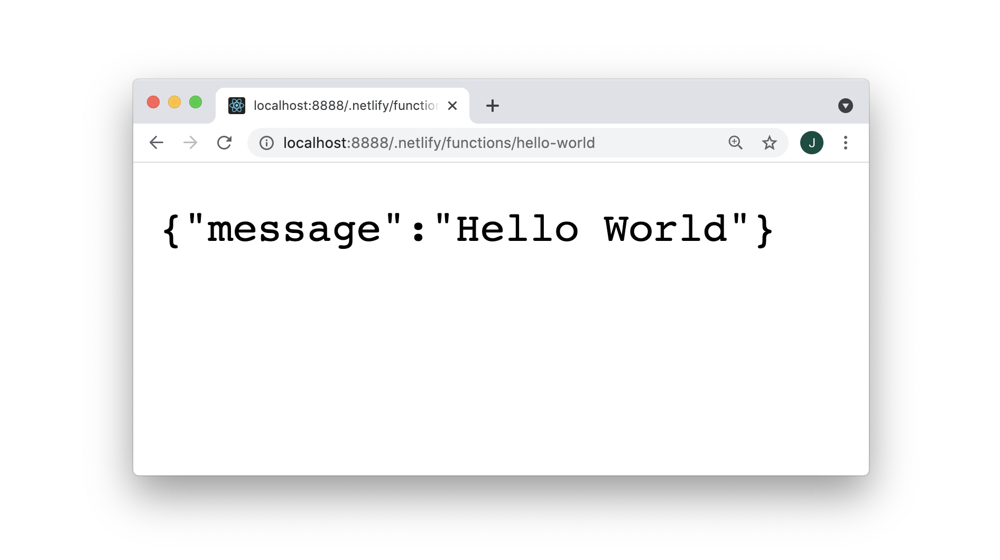
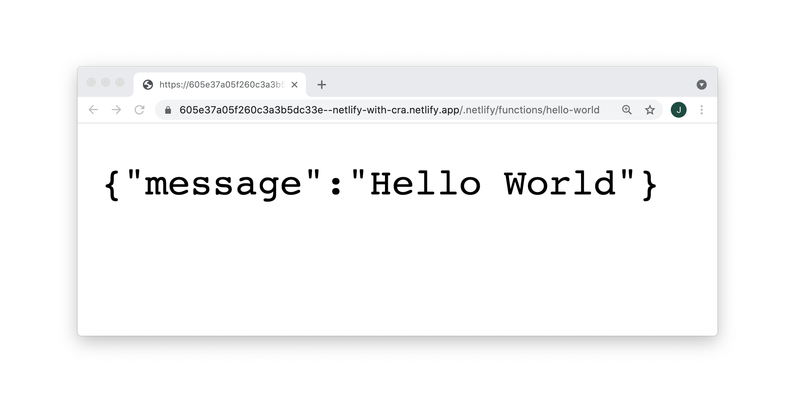

#### AWS Lambdas: Netlify With Create React App  ####

#### Project Init ####

<table>
  <thead>
    <tr><th>
      📖 Netlify Docs: <a href="https://docs.netlify.com/cli/get-started/#installation">Installation</a>
    </th></tr>
  </thead>
</table>

<pre><code>npx create-react-app netlify-with-create-react-app && cd $_</code></pre>

<pre><code>npm install netlify-cli -g</code></pre>

  
<strong>1. Log Hello World</strong>
  

  

  <table>
    <thead>
      <tr><th>
        📖 Netlify Docs: <a href="https://docs.netlify.com/functions/build-with-javascript/">Build serverless functions with JavaScript</a>
      </th></tr>
    </thead>
  </table>

  

  <table>
    <thead>
      <tr><th>
        📖 Netlify Docs: <a href="https://docs.netlify.com/cli/get-started/#get-started-with-netlify-dev">Get started with Netlify Dev</a>
      </th></tr>
    </thead>
  </table>

  

  <table>
    <thead>
      <tr><th>
        📖 Netlify Docs: <a href="https://functions.netlify.com/playground/#hello%2C-world!">Playground: Hello, World!</a>
      </th></tr>
    </thead>
  </table>

  

  <pre><code>netlify init</code></pre>

  

  

  

  <pre><code>netlify functions:create hello-world</code></pre>

  

  

  

  

  

  <pre><code>netlify functions:create hello-world</code></pre>

  

  

  

  <pre><code>netlify dev</code></pre>

  

  

  

  

  

  

  

  <table>
    <thead>
      <tr><th>
        ⚠️ Something is already running on port xxxx.
      </th></tr>
    </thead>
    <tbody>
      <tr><td>
        <code>killall node</code> 
      </td></tr>
    </tbody>
  </table>

  

  
<strong>2. Deploy Hello World</strong>
  

`
  

  <table>
    <thead>
      <tr><th>
        ⚠️ Error: No such directory  › Did you forget to run a build?
      </th></tr>
    </thead>
    <tbody>
      <tr><td>
        Set your Directory to Deploy as blank or "." during init, or through the web dashboard in Site Settings: Build & Deploy.
      </td></tr>
    </tbody>
  </table>

  

  <pre><code>netlify deploy</code></pre>

  

  

  

  
<strong>3. Pass URL Params</strong>
  

  

  <table>
    <thead>
      <tr><th>
        📖 Netlify Docs: <a href="https://functions.netlify.com/playground/#hello%2C-%7Bname%7D">Playground: Hello, {name}</a>
      </th></tr>
    </thead>
  </table>

  

  

  

  

  
<strong>4. Install NPM Packages</strong>
  

  

  <em>Details in progress.</em>

  

  
<strong>5. Set Env Values</strong>
  

  

  <table>
    <thead>
      <tr><th>
        📖 Netlify Docs: <a href="https://docs.netlify.com/configure-builds/environment-variables/#declare-variables">Environmental Variables</a>
      </th></tr>
    </thead>
  </table>

  

  

  

  

  
<strong>6. Test Authentication</strong>
  

  

  <em>Details in progress.</em>

  

  
<strong>7. Deploy Authenticated</strong>
  

  

  <table>
    <thead>
      <tr><th>
        ⚠️ TimeoutError: Task timed out after 10.00 seconds
      </th></tr>
    </thead>
    <tbody>
      <tr><td>
        Simplify your function or try Netlify's <a href="https://docs.netlify.com/functions/background-functions/">Background Functions</a>.
      </td></tr>
    </tbody>
  </table>

  

