### AWS Lambdas: <code>Netlify With Create React App</code>  ###

#### Project Init ####

<pre><code>npm install netlify-cli -g</code></pre>

<table>
  <thead>
    <tr><th>
      📖 Official Netlify Docs: <a href="https://docs.netlify.com/cli/get-started/#installation">Installation</a>
    </th></tr>
  </thead>
</table>

<pre><code>npx create-react-app netlify-with-create-react-app && cd $_</code></pre>

  
<strong>1. Log Hello World</strong>
  

  

  <pre><code>netlify init</code></pre>

  

  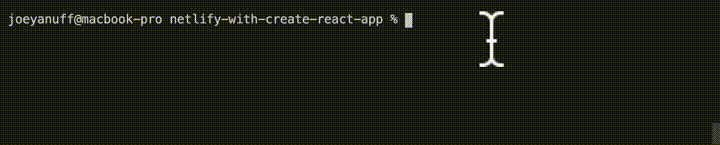

  

  <!-- <pre><code>netlify functions:create hello-world</code></pre>

  

  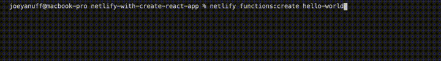

  

 -->

  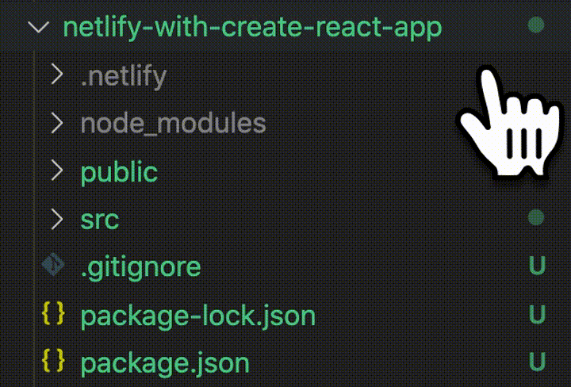

  

  <pre><code>netlify functions:create hello-world</code></pre>

  

  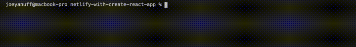

  

  <pre><code>netlify dev</code></pre>

  

  

  

  

  

  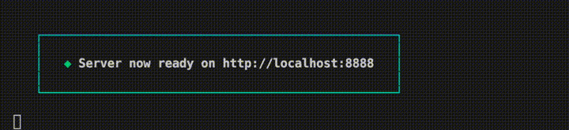

  

  <table>
    <thead>
      <tr><th>
        ⚠️ Something is already running on port xxxx.
      </th></tr>
    </thead>
    <tbody>
      <tr><td>
        <code>killall node</code> 
      </td></tr>
    </tbody>
  </table>

  

  <table>
    <thead>
      <tr><th>
        📖 Official Netlify Docs: <a href="https://docs.netlify.com/cli/get-started/#get-started-with-netlify-dev">Get started with Netlify Dev</a>
      </th></tr>
    </thead>
  </table>

  

  <table>
    <thead>
      <tr><th>
        📖 Official Netlify Docs: <a href="https://docs.netlify.com/functions/build-with-javascript/">Build serverless functions with JavaScript</a>
      </th></tr>
    </thead>
  </table>

  

  
  <table>
    <thead>
      <tr><th>
        📖 Official Netlify Docs: <a href="https://functions.netlify.com/playground/#hello%2C-world!">Playground: Hello, World!</a>
      </th></tr>
    </thead>
  </table>

  

  <table>
    <thead>
      <tr><th>
        📖 Official Netlify Docs: <a href="https://cli.netlify.com/commands/functions#functionscreate">functions:create</a>
      </th></tr>
    </thead>
  </table>

  

  
<strong>2. Deploy Hello World</strong>
  

  

  <pre><code>netlify deploy</code></pre>

  

  

  

  <table>
    <thead>
      <tr><th>
        ⚠️ Error: No such directory  › Did you forget to run a build?
      </th></tr>
    </thead>
    <tbody>
      <tr><td>
        Set your Directory to Deploy as blank or "." during init, or through the web dashboard in Site Settings: Build & Deploy.
      </td></tr>
    </tbody>
  </table>

  

  <table>
    <thead>
      <tr><th>
        📖 Official Netlify Docs: <a href="https://docs.netlify.com/functions/configure-and-deploy/">Configure and deploy Functions</a>
      </th></tr>
    </thead>
  </table>

  

  
<strong>3. Pass URL Params</strong>
  

  

  <pre><code>exports.handler = async (event, context) => {
  const name = event.queryStringParameters.name || "World";

  return {
    statusCode: 200,
    body: `Hello ${name}`,
  };
};</code></pre>

  

  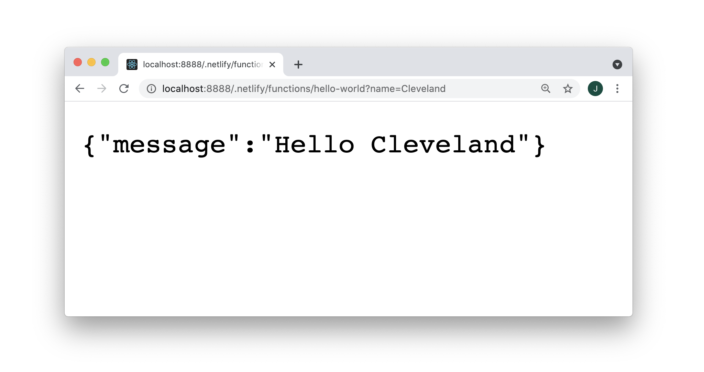

  

  <table>
    <thead>
      <tr><th>
        📖 Official Netlify Docs: <a href="https://functions.netlify.com/playground/#hello%2C-%7Bname%7D">Playground: Hello, {name}</a>
      </th></tr>
    </thead>
  </table>

  

  
<strong>4. Install NPM Packages</strong>
  

  

  <pre><code>npm i @astrajs/collections</code></pre>

  

  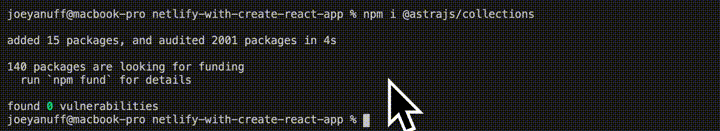

  

  
<strong>5. Set Env Values</strong>
  

  

  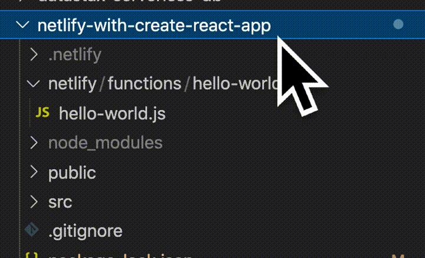

  

  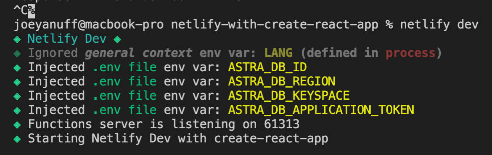

  

  <pre><code>const handler = async (event) => {
  try {
    const region = process.env.ASTRA_DB_REGION
    const subject = event.queryStringParameters.name || 'World'
    return {
      statusCode: 200,
      body: JSON.stringify({ message: `Hello, ${subject}. Region: ${region}` }),
    }
  } catch (error) {
    return { statusCode: 500, body: error.toString() }
  }
}</code></pre>

  

  <pre><code>netlify dev</code></pre>

  

  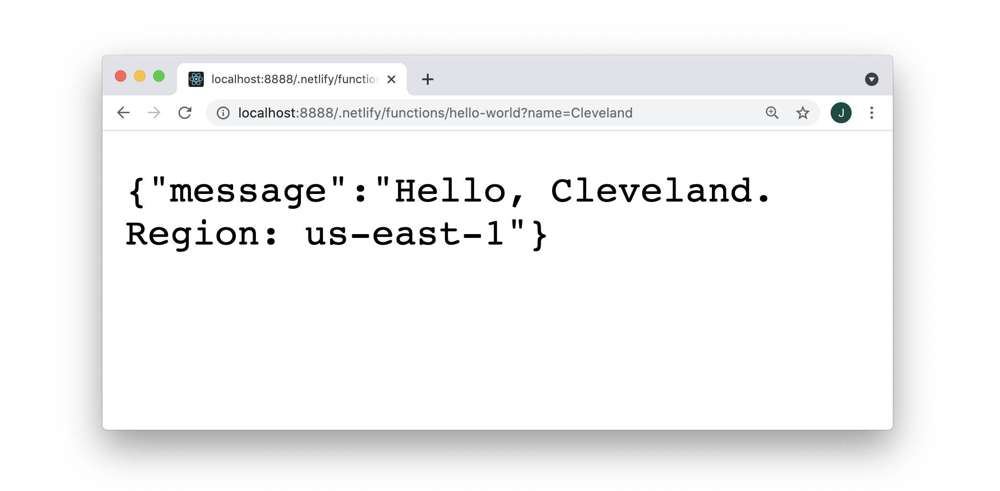

  

  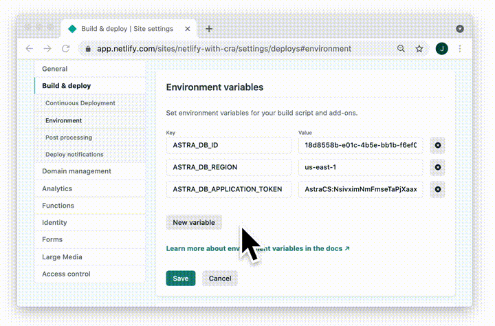
  
  

  <table>
    <thead>
      <tr><th>
        📖 Official Netlify Docs: <a href="https://docs.netlify.com/configure-builds/environment-variables/#declare-variables">Environmental Variables</a>
      </th></tr>
    </thead>
  </table>

  

  
<strong>6. Test Token</strong>
  

  

  <pre><code>const { createClient } = require("@astrajs/collections");

const handler = async (event) => {
  try {
    const region = process.env.ASTRA_DB_REGION

    // create an Astra client  
    const astraClient = await createClient({
      astraDatabaseId: process.env.ASTRA_DB_ID,
      astraDatabaseRegion: process.env.ASTRA_DB_REGION,
      applicationToken: process.env.ASTRA_DB_APPLICATION_TOKEN,
    });

    const subject = event.queryStringParameters.name || 'World'

    return {
      statusCode: 200,
      body: JSON.stringify({ 
        message: `Hello, ${subject}. 
                  Region: ${region}.
                  Astra Token: ${astraClient.restClient.applicationToken}.` }),
    }
  } catch (error) {
    return { statusCode: 500, body: error.toString() }
  }
}

module.exports = { handler }</code></pre>

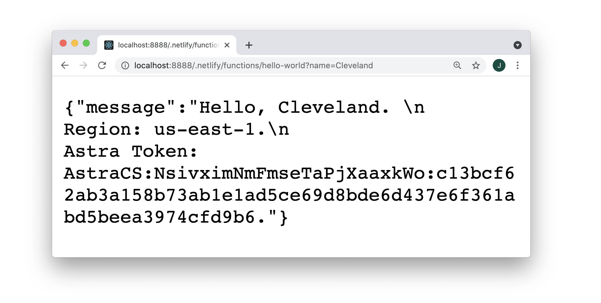

  
<strong>7. Deploy Authenticated</strong>
  

  

  <pre><code>netlify deploy</code></pre>

  

  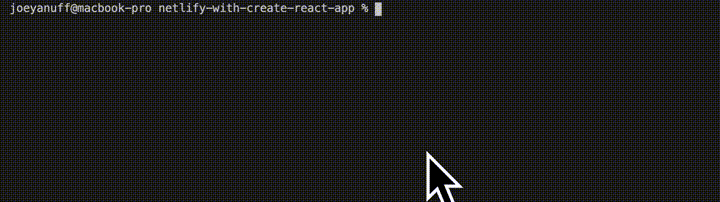

  

  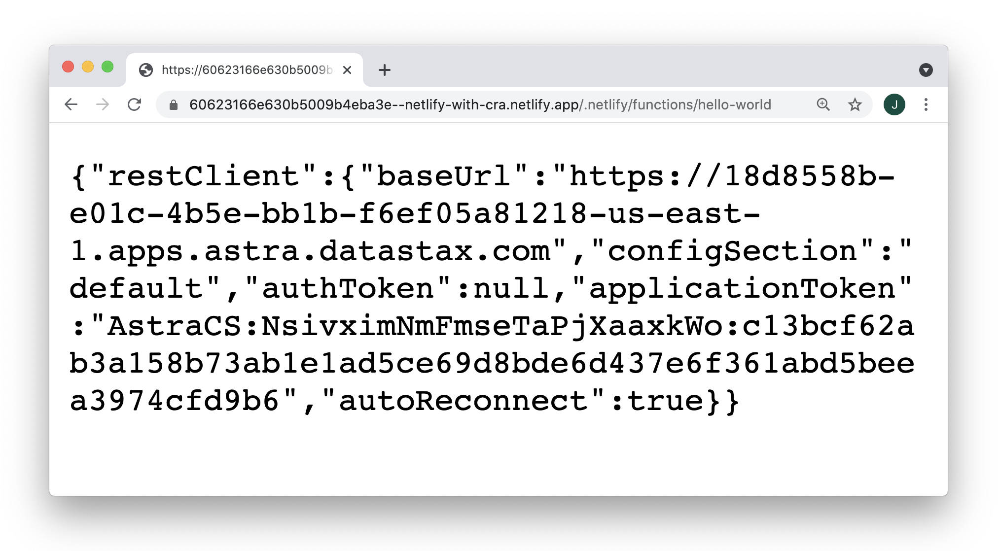

  

  <!-- <table>
    <thead>
      <tr><th>
        ⚠️ Error: @astrajs/rest: baseUrl required for initialization
      </th></tr>
    </thead>
    <tbody>
      <tr><td>
        Not yet sure what's happening here.
      </td></tr>
    </tbody>
  </table> -->

  

  <!-- <table>
    <thead>
      <tr><th>
        ⚠️ TimeoutError: Task timed out after 10.00 seconds
      </th></tr>
    </thead>
    <tbody>
      <tr><td>
        Simplify your function or try Netlify's <a href="https://docs.netlify.com/functions/background-functions/">Background Functions</a>.
      </td></tr>
    </tbody>
  </table> -->

