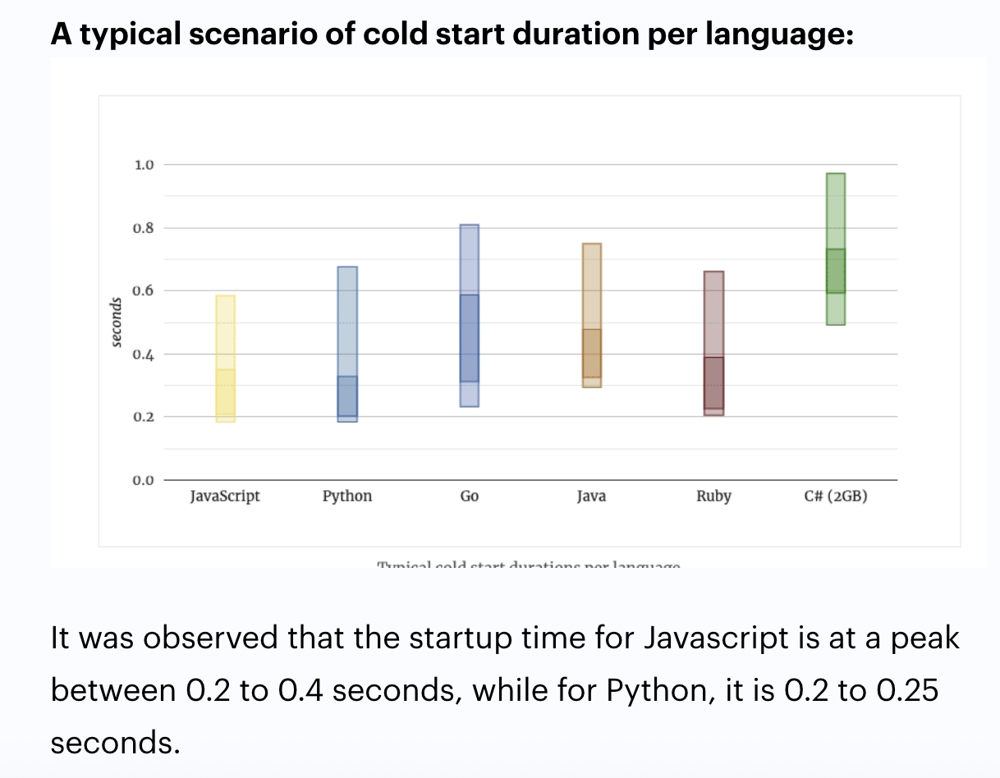

### *AWS Lambdas: Easy, Easier, Easiest* ###

_“**When not to choose AWS**
Where AWS becomes overkill are typical JAMstack apps. A static site with lots of frontend logic. Hosting those on AWS is a pain whereas Netlify and Vercel make them a core feature.”-***Swizec Teller***, [_Serverless Handbook: AWS, Vercel, Netlify, or Firebase?_](https://serverlesshandbook.dev/serverless-flavors/)_


- - -

<details open>
  <summary><code>Amplify</code></summary>
  <p>

  [Set-up instructions for Amplify](amplify-with-create-react-app)
  </p>
  </details>

<details>
  <summary><code>Netlify</code></summary>
  <p>

  [Set-up instructions for Netlify](netlify-with-create-react-app)
  </p>
</details>


<details>
  <summary><code>Vercel</code></summary>
  <p>

  [Set-up instructions for Vercel](vercel-with-next-js)
  </p>
</details>

---


**Serverless Quotes That Explain Well**

*“You can use Serverless Functions to solve (almost) any backend needs you have without deploying and maintaining a server yourself.”*
-***Dorcas Ferry***, [_Serverless Functions, Netlify vs Vercel, and the Jamstack_](https://morioh.com/p/dc014b3356d2)

*“For static content, everything is prebuilt and cached. For dynamic content, companies build microservices that are loaded on demand and that can scale easily.”*
-***Romain Dillet***, [_Cloudflare is testing a Netlify competitor to host Jamstack sites_](https://techcrunch.com/2020/12/07/cloudflare-is-testing-a-netlify-competitor-to-host-jamstack-sites/)


*“Unlike Netlify, Vercel simplifies its serverless function signature by only accepting requests and responses as parameters, which is achieved by wrapping the original AWS Lambda environment and simplifying it only for serving content purposes. Brilliant idea!”*
-***Emrah Samdan***, [_Why do companies invent their own serverless functions?_](https://blog.thundra.io/why-do-companies-invent-their-own-serverless-functions)

- - -

<details>
<summary><kbd>&nbsp;Database-as-a-Service 💭</kbd></summary>

  <p>

  [Set-up instructions for Vercel](vercel)
  </p>
</details>

- - -

AWS Lambdas: 3 Ways to Deploy


- [ ] An uncompleted task

---

*AWS Lambdas, with or without AWS*

* Because I've known AWS Lambdas to be tricky
* Because I easily forget simple instructions
* Because I need a place to keep my tricks
* Because I need a place to save my tabs
* Because I wanted to compare workflows side-by-side


*ANIMATION TEST*

**GIF (432KB)**


**WEBP (1.4MB)**


**FFMPEG GIF (24KB)**


---

### Specific Language Code ###


```javascript
const { createClient } = require("@astrajs/collections")

export default async (req, res) => {
  const { query: { name } } = req

  const astraClient = await createClient({
    astraDatabaseId: process.env.ASTRA_DB_ID,
    astraDatabaseRegion: process.env.ASTRA_DB_REGION,
    username: process.env.ASTRA_DB_USERNAME,
    password: process.env.ASTRA_DB_PASSWORD,
  })

  const collection = astraClient
    .namespace(process.env.ASTRA_DB_KEYSPACE)
    .collection(name)

  res.send(collection)
}
```

---
<p align="center">


_-[Jignash Solanki, AWS Lambda Performance Tuning & Best Practices (2021)](https://www.simform.com/aws-lambda-performance/)_
<p>