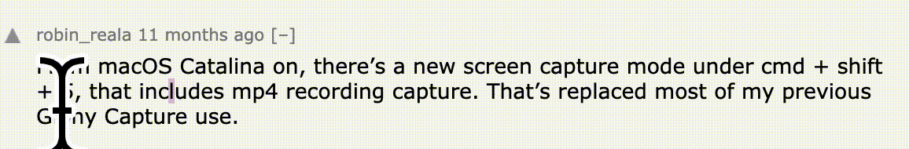
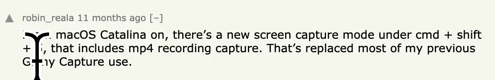

### *AWS Lambdas: Easy, Easier, Easiest* ###


*“You can use Serverless Functions to solve (almost) any backend needs you have without deploying and maintaining a server yourself.”*
-[_Dorcas Ferry_](https://morioh.com/p/dc014b3356d2)

- - -

<details open>
  <summary><code>Amplify</code></summary>
  <p>

  [Set-up instructions for Amplify](amplify-with-create-react-app)
  </p>
  </details>

<details>
  <summary><code>Netlify</code></summary>
  <p>

  [Set-up instructions for Netlify](netlify-with-create-react-app)
  </p>
</details>


<details>
  <summary><code>Vercel</code></summary>
  <p>

  [Set-up instructions for Vercel](vercel-with-next-js)
  </p>
</details>

---
<details>
<summary><kbd>&nbsp;Deep Thoughts 💭</kbd></summary>

  <p>

  [Set-up instructions for Vercel](vercel)
  </p>
</details>

- - -


<kbd>&nbsp;Deep Thoughts :thought_balloon:</kbd>

AWS Lambdas: 3 Ways to Deploy

**Serverless APIs Deployment Checklist**

- [ ] An uncompleted task

---

*AWS Lambdas, with or without AWS*

* Because I've known AWS Lambdas to be tricky
* Because I easily forget simple instructions
* Because I need a place to keep my tricks
* Because I need a place to save my tabs
* Because I wanted to compare workflows side-by-side


[Set-up instructions for Vercel](vercel/README.md)


*ANIMATION TEST*

**GIF (432KB)**



**WEBP (1.4MB)**




**FFMPEG GIF (24KB)**


---

### Specific Language Code ###


```javascript
const { createClient } = require("@astrajs/collections")

export default async (req, res) => {
  const { query: { name } } = req

  const astraClient = await createClient({
    astraDatabaseId: process.env.ASTRA_DB_ID,
    astraDatabaseRegion: process.env.ASTRA_DB_REGION,
    username: process.env.ASTRA_DB_USERNAME,
    password: process.env.ASTRA_DB_PASSWORD,
  })

  const collection = astraClient
    .namespace(process.env.ASTRA_DB_KEYSPACE)
    .collection(name)

  res.send(collection)
}
```