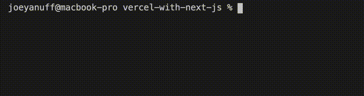

#### AWS Lambdas: Vercel With Next.js  ####

#### Project Init ####

<pre><code>npx create-next-app vercel-with-next-js && cd $_</code></pre>

<pre><code>npm i -g vercel</code></pre>

  
<strong>1. Log Hello World</strong>
  

  

  <table>
    <thead>
      <tr><th>
        📖 Vercel Docs: <a href="https://vercel.com/docs/serverless-functions/introduction#path-segments">Local Development</a>
      </th></tr>
    </thead>
  </table>

  

  <pre><code>npm run dev</code></pre>

  

  

  

  <table>
    <thead>
      <tr><th>
        📖 Next.js Docs: <a href="https://nextjs.org/docs/api-routes/introduction">API Routes</a>
      </th></tr>
    </thead>
  </table>

  

  

  

  
<strong>2. Deploy Hello World</strong>
  

  

  <table>
    <thead>
      <tr><th>
        📖 Vercel Docs: <a href="https://nextjs.org/docs/deployment">Deployment</a>
      </th></tr>
    </thead>
  </table>

  

  

  

  

  

  
<strong>3. Pass URL Params</strong>
  

  

  <strong><em>vercel-with-next-js > pages > api > hello.js</em></strong>
  

  <pre><code>export default (req, res) => {
    const name = req.query.name ?? "World"
    res.status(200).json({ body: `Hello ${name}` })
  }</code></pre>

  

  

  

  <table>
    <thead>
      <tr><th>
        📖 Vercel Docs: <a href="https://vercel.com/docs/serverless-functions/introduction#path-segments">Path Segments</a>
      </th></tr>
    </thead>
  </table>

  

  <strong><em>vercel-with-next-js > pages > api > hello > [name].js</em></strong>
  

  <pre><code>export default function handler(req, res) {
    const { name } = req.query
    res.end(`Hello ${name} (v2)`)
  }</code></pre>

  

  

  

  
<strong>4. Install NPM Packages</strong>
  

  

  <pre><code>npm i @astrajs/collections</code></pre>

  

  

  

  
<strong>5. Set Env Values</strong>
  

  

  <table>
    <thead>
      <tr><th>
        📖 Next.js Docs: <a href="https://nextjs.org/docs/basic-features/environment-variables">Environmental Variables</a>
      </th></tr>
    </thead>
  </table>

  

  <table>
    <thead>
      <tr><th>
        📖 Vercel Docs: <a href="https://vercel.com/docs/environment-variables">Environmental Variables</a>
      </th></tr>
    </thead>
  </table>

  

  

  

  

  

  

  

  

  

  
<strong>6. Test Authentication</strong>
  

  

  <pre><code>const { createClient } = require("@astrajs/collections");

export default async (req, res) => {
  const region = process.env.ASTRA_DB_REGION
  const name = req.query.name ?? "World"
  
  // create an Astra client  
  const astraClient = await createClient({
    astraDatabaseId: process.env.ASTRA_DB_ID,
    astraDatabaseRegion: process.env.ASTRA_DB_REGION,
    applicationToken: process.env.ASTRA_DB_APPLICATION_TOKEN,
  });
  
  res.status(200).json({ 
    body: `Hello ${name}. 
           Region: ${region}.
           Token: ${astraClient.restClient.applicationToken}.` 
          })
}</code></pre>

  

  

  
<strong>7. Deploy Authenticated</strong>
  

  

  

  

  

  

